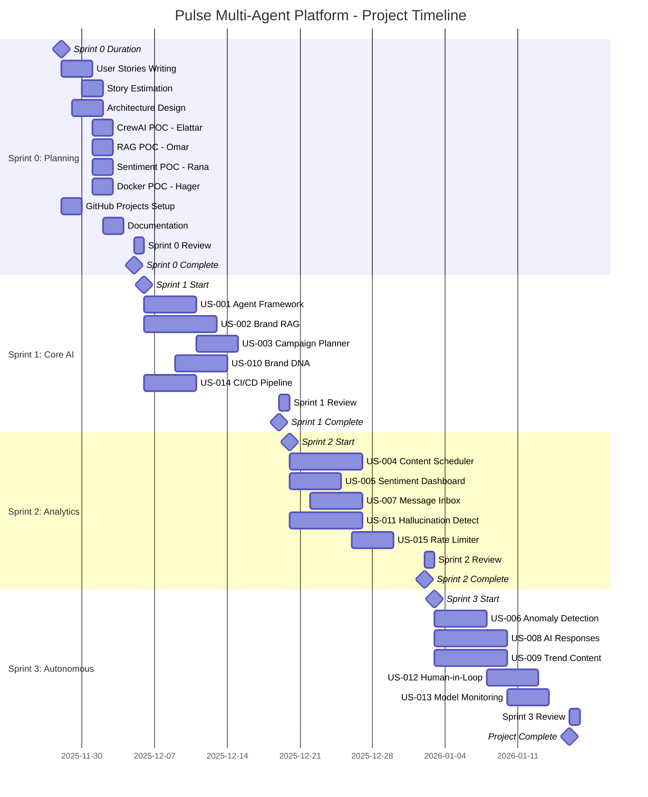
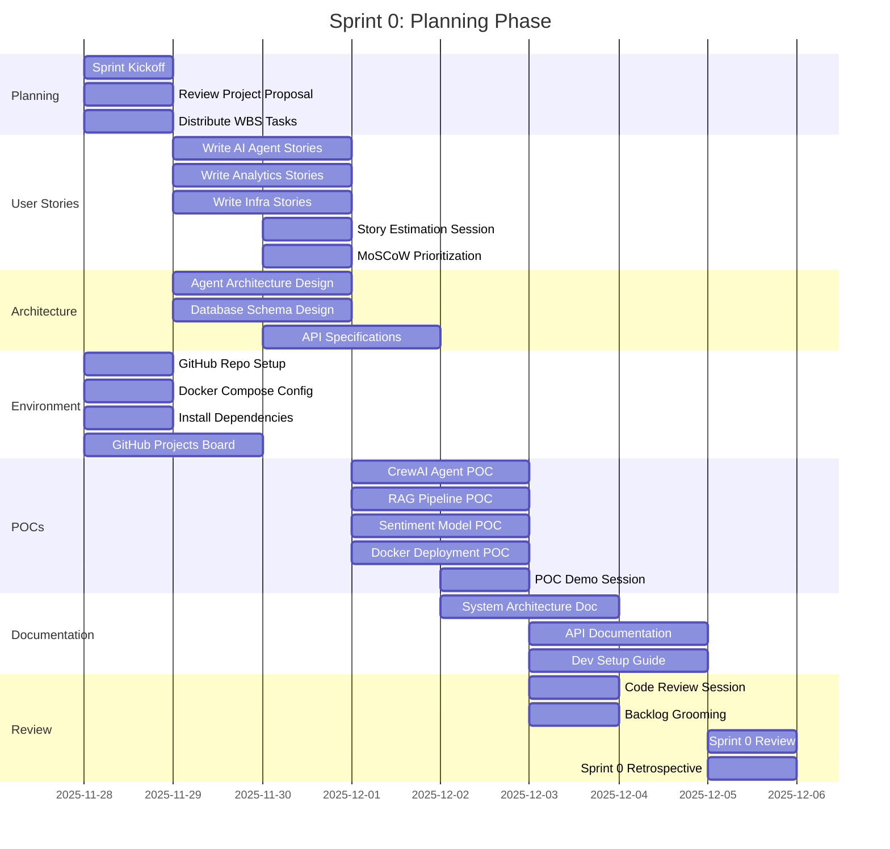
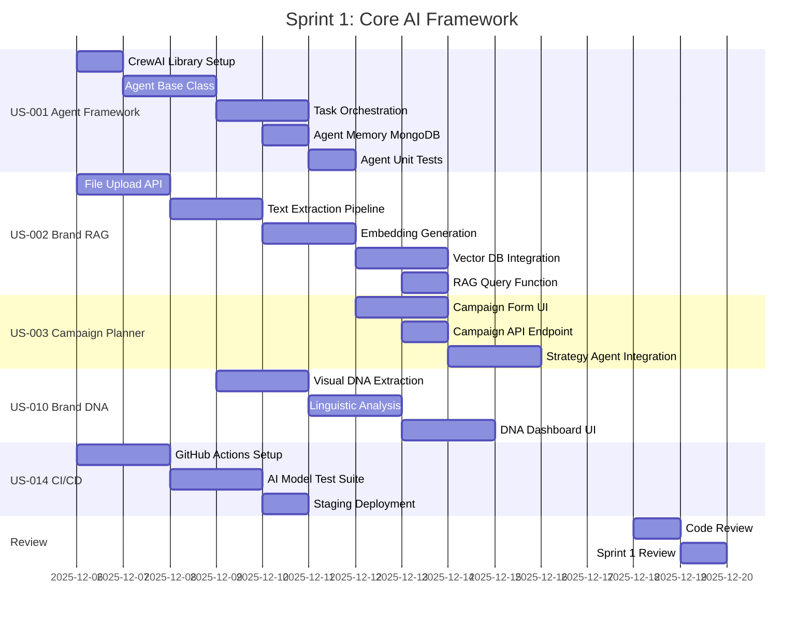
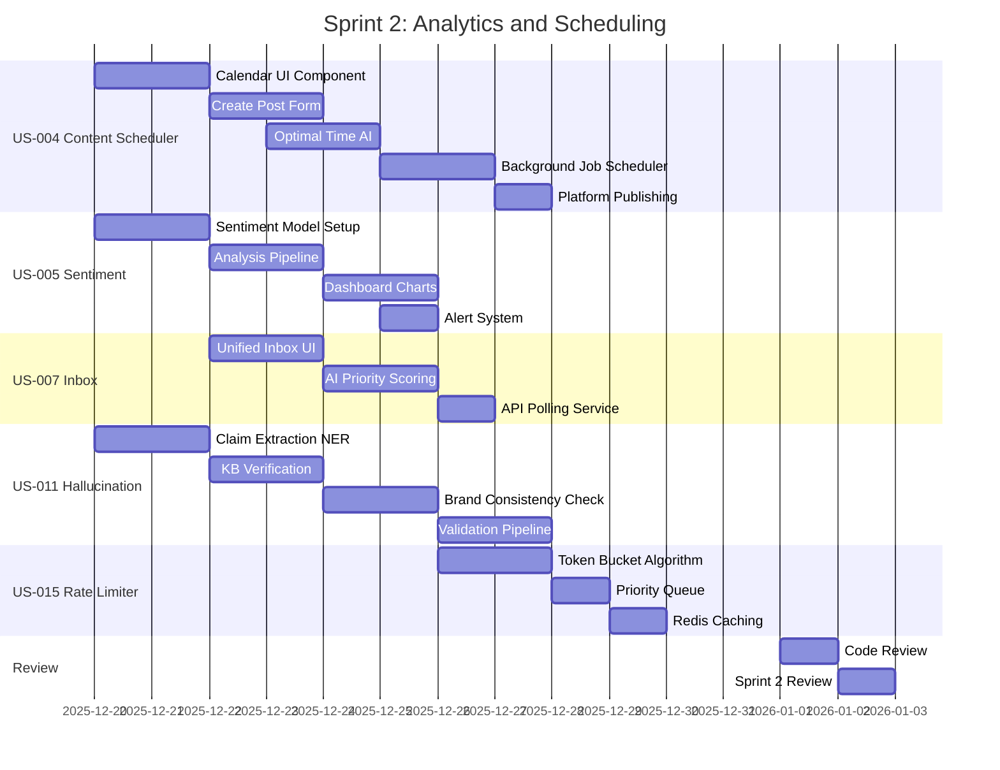
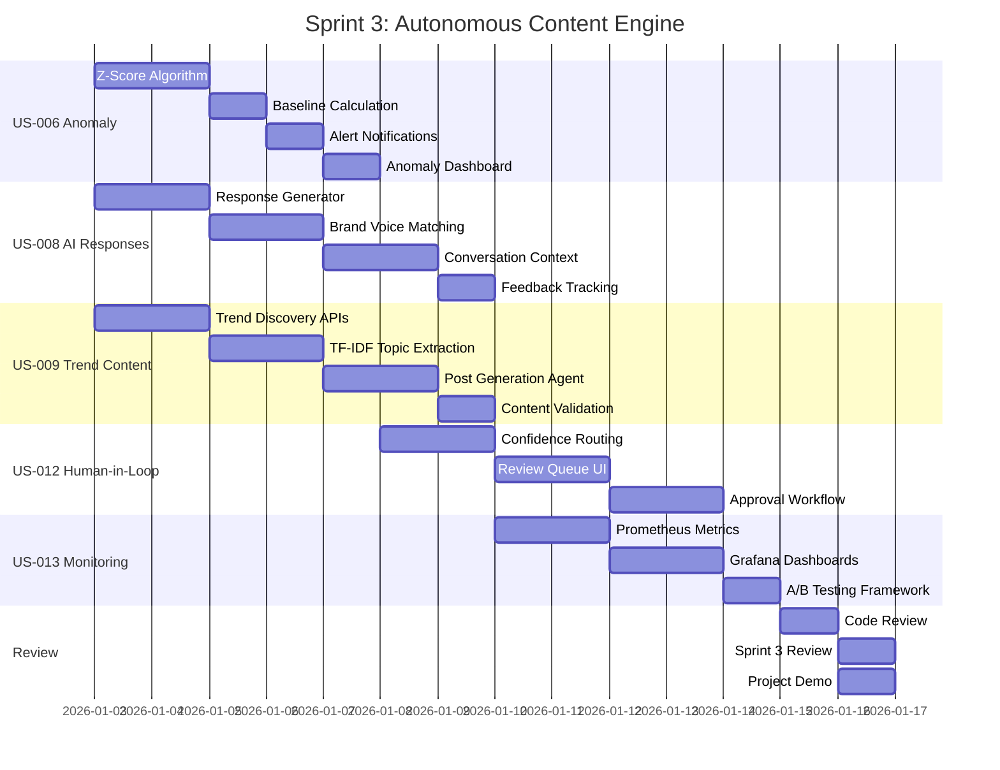
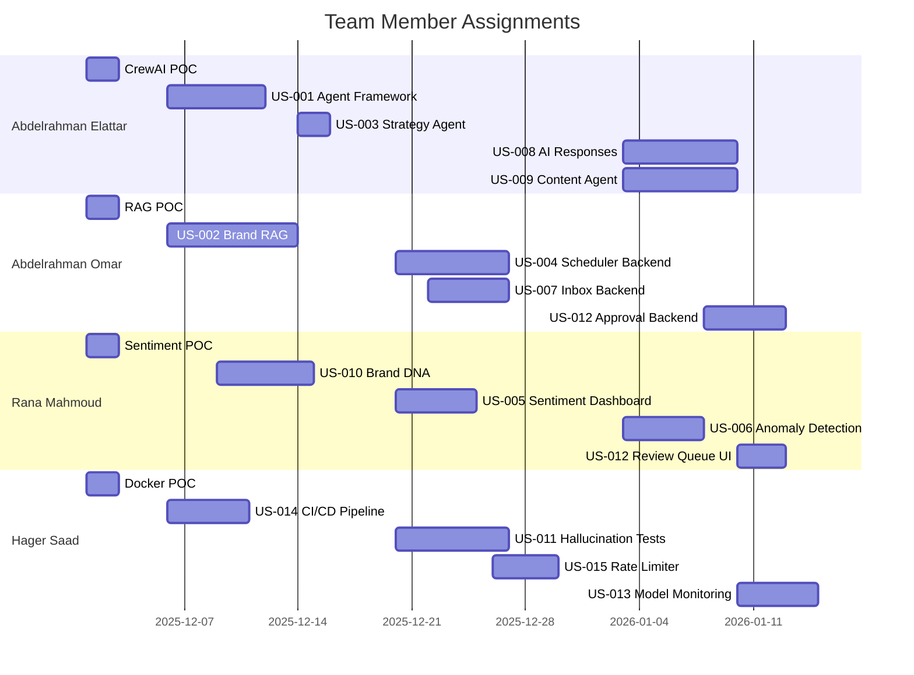

# 📅 Pulse Multi-Agent Platform - Gantt Chart

## Project Timeline Overview

---

## Sprint 0 Detailed Timeline (Nov 28 - Dec 5)

---

## Sprint 1 Detailed Timeline (Dec 6 - Dec 19)

---

## Sprint 2 Detailed Timeline (Dec 20 - Jan 2)

---

## Sprint 3 Detailed Timeline (Jan 3 - Jan 16)

---

## Team Assignments Timeline

---

## Summary

| Sprint | Duration | Stories | Story Points |
|--------|----------|---------|--------------|
| **Sprint 0** | Nov 28 - Dec 5 | Planning Only | - |
| **Sprint 1** | Dec 6 - Dec 19 | 5 stories | 42 pts |
| **Sprint 2** | Dec 20 - Jan 2 | 5 stories | 42 pts |
| **Sprint 3** | Jan 3 - Jan 16 | 5 stories | 42 pts |
| **Total** | 7 weeks | 15 stories | 126 pts |
