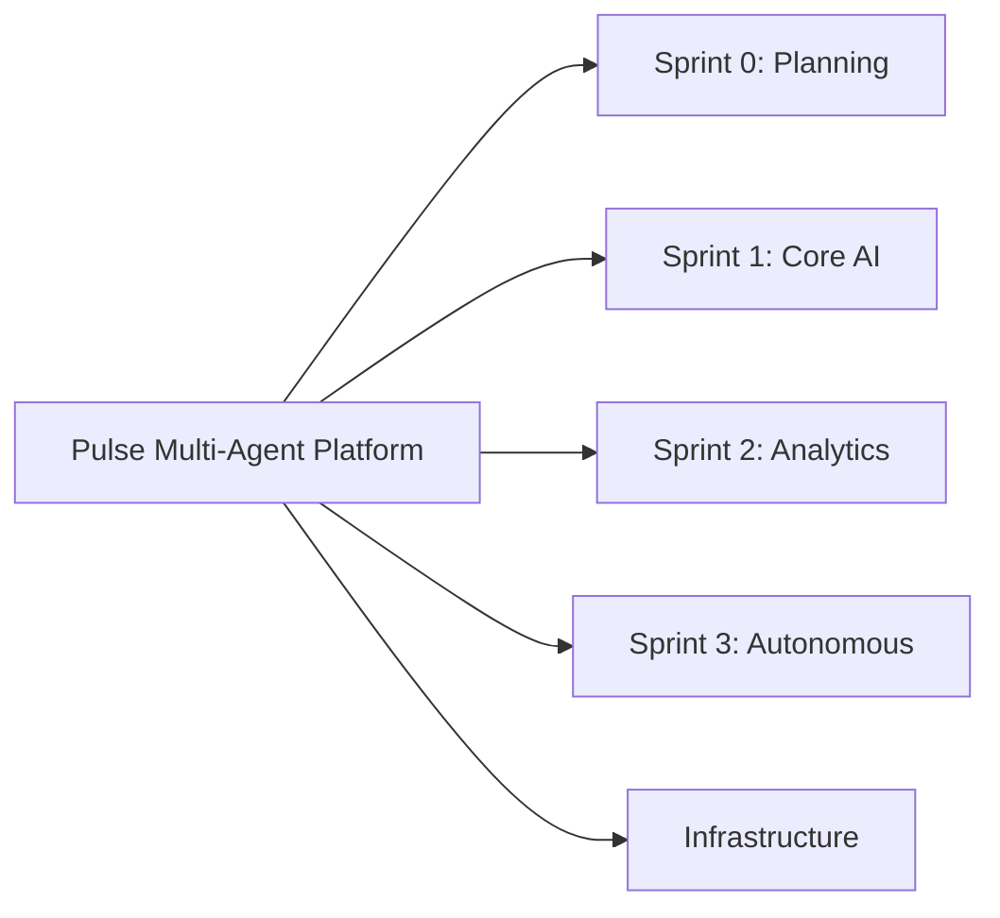
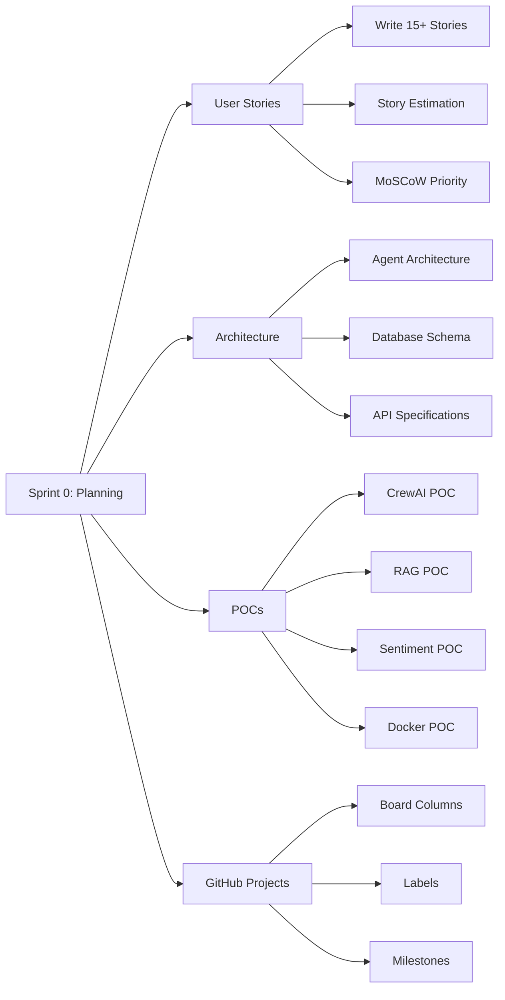
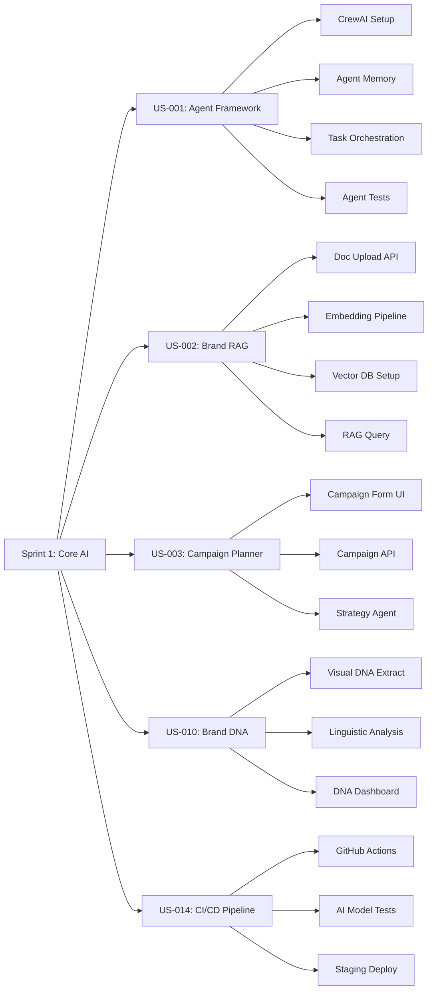
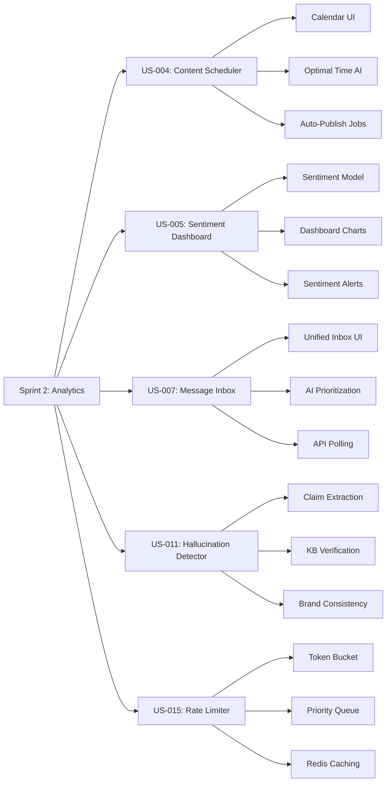
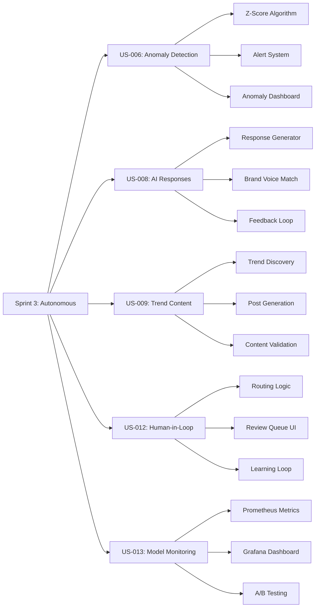
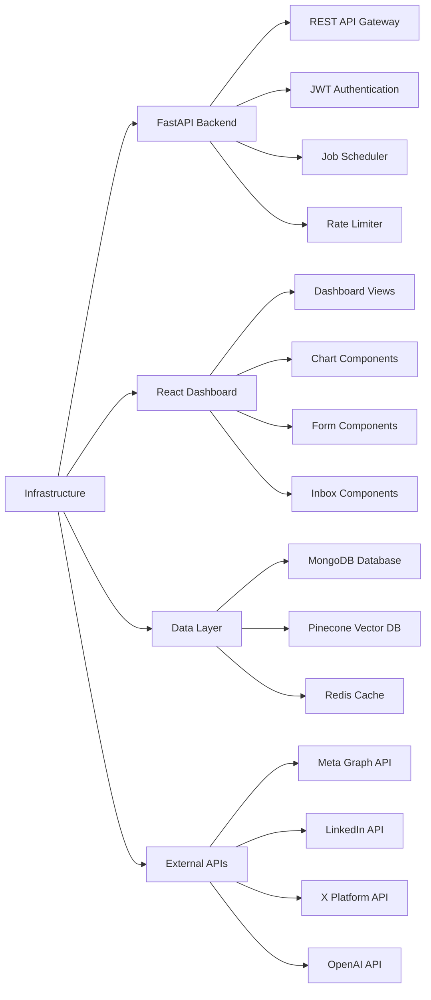
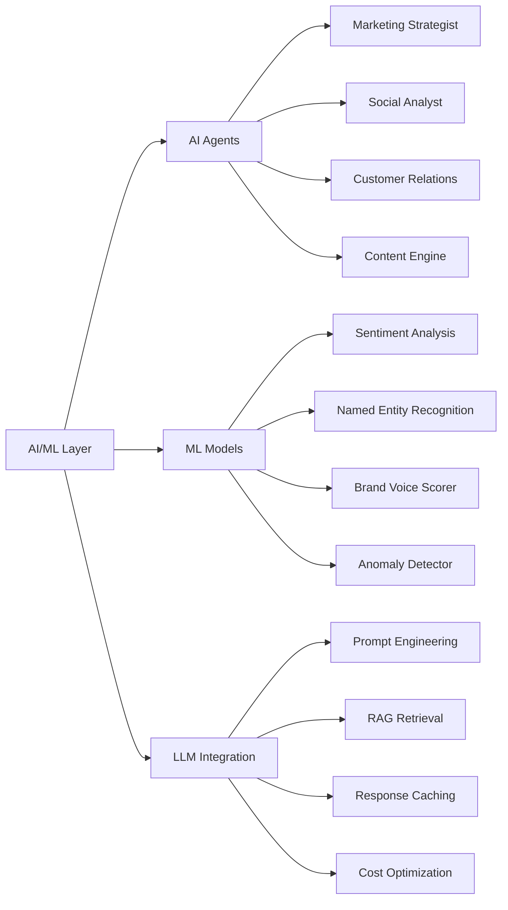
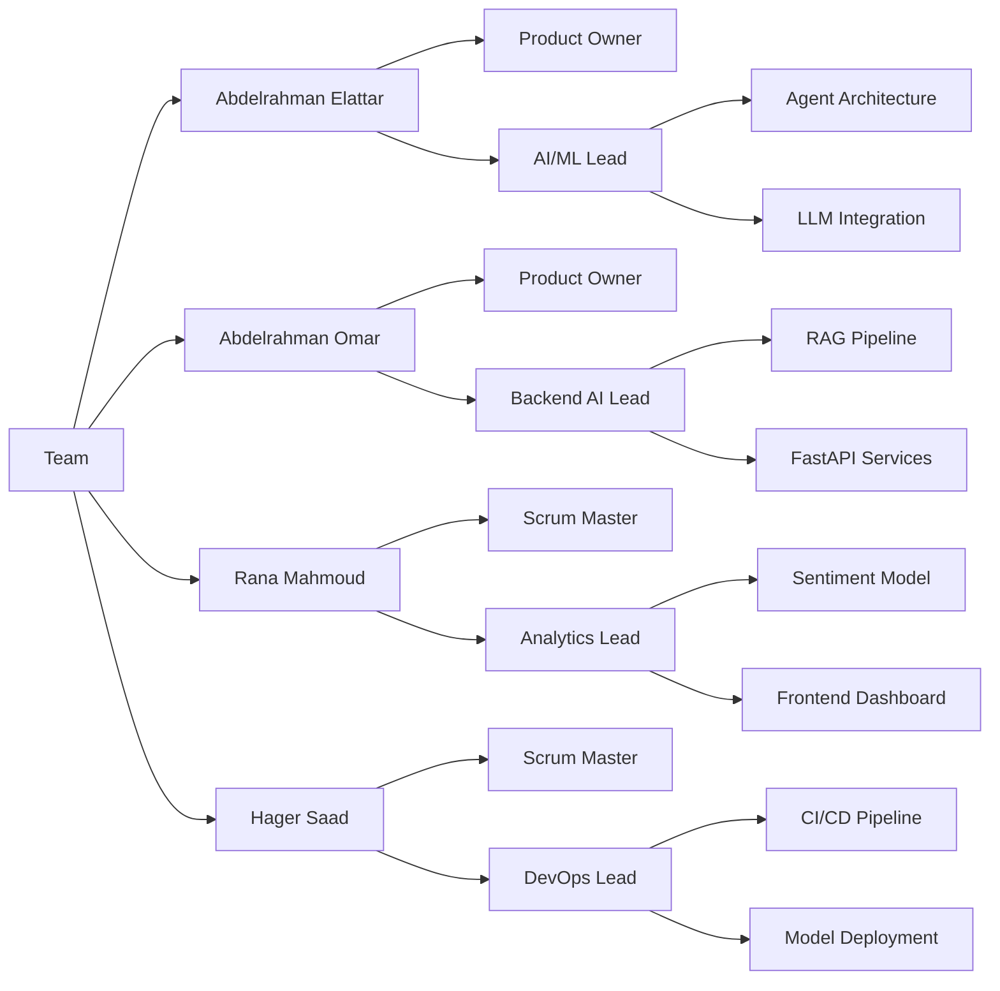
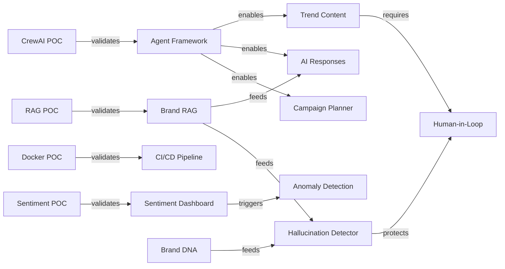

# 📊 Pulse Multi-Agent Platform - Work Breakdown Structure

## Project Overview

---

## Sprint 0: Planning Phase

---

## Sprint 1: Core AI Framework

---

## Sprint 2: Analytics & Scheduling

---

## Sprint 3: Autonomous Content

---

## Infrastructure Components

---

## AI/ML Components

---

## Team Responsibilities

---

## Dependencies

---

## Sprint Timeline

| Sprint | Dates | Focus | Key Deliverables |
|--------|-------|-------|------------------|
| **Sprint 0** | Nov 28 - Dec 5 | Planning | User Stories, Architecture, POCs, GitHub Projects |
| **Sprint 1** | Dec 6 - Dec 19 | Core AI | Agent Framework, RAG System, Brand DNA, CI/CD |
| **Sprint 2** | Dec 20 - Jan 2 | Analytics | Scheduler, Sentiment, Inbox, Hallucination Detection |
| **Sprint 3** | Jan 3 - Jan 16 | Autonomous | Content Generation, Approval Workflow, Monitoring |
