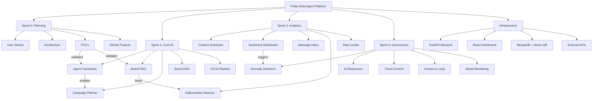
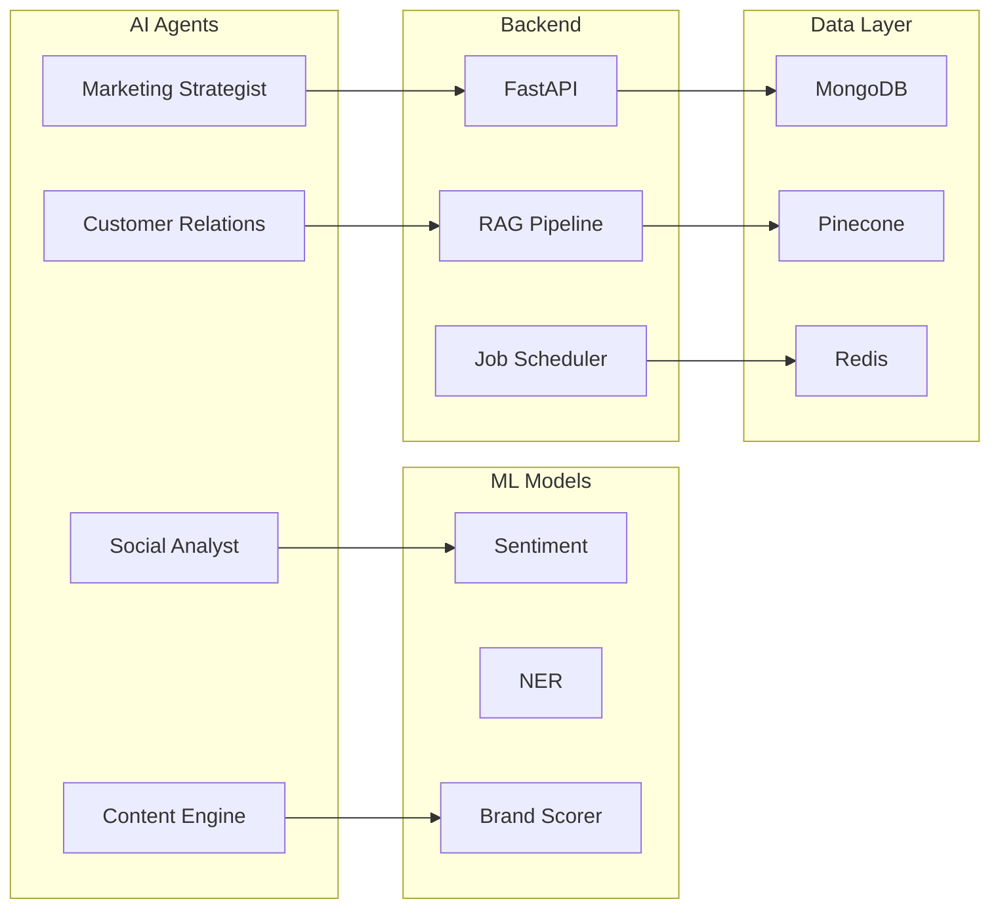
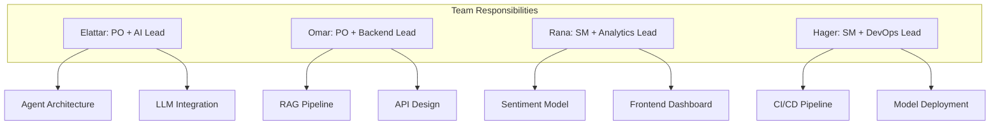

# 📊 Pulse Multi-Agent Platform - Work Breakdown Structure

---

---

---

## Sprint Timeline

| Sprint | Dates | Deliverables |
|--------|-------|--------------|
| **Sprint 0** | Nov 28 - Dec 5 | Planning, POCs, Architecture |
| **Sprint 1** | Dec 6 - Dec 19 | Agent Framework, RAG, CI/CD |
| **Sprint 2** | Dec 20 - Jan 2 | Scheduler, Sentiment, Inbox |
| **Sprint 3** | Jan 3 - Jan 16 | Content Gen, Approval Workflow |
