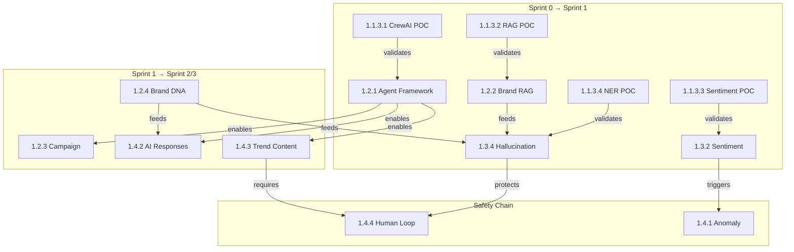

# 📊 Work Breakdown Structure (WBS)
## Pulse Multi-Agent Platform

**Project Duration:** Nov 28, 2024 – Jan 16, 2025 | **Team:** 4 AI Engineers | **Methodology:** Agile Scrum

---

## 🎯 Level 0: Project Root

| WBS | Name | Description |
|-----|------|-------------|
| **1.0** | **Pulse Multi-Agent Platform** | AI-powered social media marketing automation using CrewAI, RAG, and autonomous content generation |

---

## 📋 Level 1: Project Phases

| WBS | Phase | Timeline | Story Points | Owner |
|-----|-------|----------|--------------|-------|
| 1.1 | Sprint 0: Planning & Foundation | Nov 28 - Dec 5 | - | All Team |
| 1.2 | Sprint 1: Core AI Framework | Dec 6 - Dec 19 | 42 | All Team |
| 1.3 | Sprint 2: Analytics & Scheduling | Dec 20 - Jan 2 | 47 | All Team |
| 1.4 | Sprint 3: Autonomous Content | Jan 3 - Jan 16 | 47 | All Team |
| 1.5 | Infrastructure Layer | Ongoing | - | All Team |
| 1.6 | AI/ML Components | Ongoing | - | All Team |
| 1.7 | Project Management | Ongoing | - | Scrum Masters |

---

## 📦 Level 2: Deliverables (Epics)

### 1.1 Sprint 0: Planning & Foundation

| WBS | Deliverable | Owner | Status |
|-----|-------------|-------|--------|
| 1.1.1 | Requirements Engineering | Abdelrahman E. + O. | ✅ |
| 1.1.2 | System Architecture Design | All Team | ✅ |
| 1.1.3 | Proof of Concept Development | All Team | ✅ |
| 1.1.4 | Project Board Setup | Rana + Hager | ✅ |
| 1.1.5 | Risk Assessment | Scrum Masters | ✅ |

### 1.2 Sprint 1: Core AI Framework

| WBS | User Story | Points | Owner | Priority |
|-----|------------|--------|-------|----------|
| 1.2.1 | US-001: Multi-Agent Framework | 8 | Abdelrahman E. | P0 |
| 1.2.2 | US-002: Brand Knowledge RAG | 13 | Abdelrahman O. | P1 |
| 1.2.3 | US-003: AI Campaign Planner | 5 | Abdelrahman E. + Rana | P1 |
| 1.2.4 | US-010: Brand DNA Extraction | 8 | Abdelrahman O. + Rana | P1 |
| 1.2.5 | US-014: CI/CD Pipeline | 8 | All Team (Shared) | P1 |

### 1.3 Sprint 2: Analytics & Scheduling

| WBS | User Story | Points | Owner | Priority |
|-----|------------|--------|-------|----------|
| 1.3.1 | US-004: Content Scheduler | 13 | Abdelrahman O. + Rana | P1 |
| 1.3.2 | US-005: Sentiment Dashboard | 8 | Rana (Lead) | P1 |
| 1.3.3 | US-007: Unified Message Inbox | 8 | Abdelrahman O. + Hager | P1 |
| 1.3.4 | US-011: Hallucination Detection | 13 | Hager (Lead) + Abdelrahman O. | P0 |
| 1.3.5 | US-015: API Rate Limiter | 5 | All Team (Shared) | P1 |

### 1.4 Sprint 3: Autonomous Content Engine

| WBS | User Story | Points | Owner | Priority |
|-----|------------|--------|-------|----------|
| 1.4.1 | US-006: Anomaly Detection | 8 | Rana (Lead) | P2 |
| 1.4.2 | US-008: AI Response Generator | 13 | Abdelrahman E. + Hager | P1 |
| 1.4.3 | US-009: Trend-Based Content | 13 | Hager (Lead) + Abdelrahman E. | P1 |
| 1.4.4 | US-012: Human-in-the-Loop | 8 | Abdelrahman O. + Rana | P1 |
| 1.4.5 | US-013: Model Monitoring | 5 | All Team (Shared) | P2 |

### 1.5 Infrastructure Layer

| WBS | Component | Owner |
|-----|-----------|-------|
| 1.5.1 | Backend Services (FastAPI) | Abdelrahman O. |
| 1.5.2 | Frontend Application (React) | Rana |
| 1.5.3 | Data Persistence Layer | Abdelrahman O. |
| 1.5.4 | External API Integrations | All Team |
| 1.5.5 | DevOps & Deployment | All Team (Shared) |

### 1.6 AI/ML Components

| WBS | Component | Owner |
|-----|-----------|-------|
| 1.6.1 | AI Agent Ecosystem | Abdelrahman E. |
| 1.6.2 | Machine Learning Models | Rana + Hager |
| 1.6.3 | LLM Integration Layer | Abdelrahman E. + O. |
| 1.6.4 | Knowledge Base Management | Abdelrahman O. |

---

## 🔧 Level 3: Work Packages

### 1.1.1 Requirements Engineering
| WBS | Task | Hours | Owner |
|-----|------|-------|-------|
| 1.1.1.1 | Stakeholder interviews | 4h | Abdelrahman E. |
| 1.1.1.2 | Write 15+ user stories | 8h | All Team |
| 1.1.1.3 | Story point estimation | 2h | All Team |
| 1.1.1.4 | MoSCoW prioritization | 2h | Product Owners |
| 1.1.1.5 | Create GitHub backlog | 2h | Scrum Masters |

### 1.1.2 System Architecture Design
| WBS | Task | Hours | Owner |
|-----|------|-------|-------|
| 1.1.2.1 | Multi-agent architecture diagram | 4h | Abdelrahman E. |
| 1.1.2.2 | Database schema design | 4h | Abdelrahman O. |
| 1.1.2.3 | API specifications (OpenAPI) | 4h | Abdelrahman O. |
| 1.1.2.4 | System integration diagram | 3h | All Team |
| 1.1.2.5 | Security architecture (JWT) | 3h | All Team |

### 1.1.3 Proof of Concept Development
| WBS | Task | Hours | Owner |
|-----|------|-------|-------|
| 1.1.3.1 | CrewAI multi-agent POC | 8h | Abdelrahman E. |
| 1.1.3.2 | RAG pipeline POC | 8h | Abdelrahman O. |
| 1.1.3.3 | Sentiment analysis POC | 6h | Rana |
| 1.1.3.4 | NER & Content Generation POC | 8h | Hager |
| 1.1.3.5 | Social media API POC | 4h | All Team |

### 1.2.1 US-001: Multi-Agent Framework (8 pts)
| WBS | Task | Hours | Owner | Deps |
|-----|------|-------|-------|------|
| 1.2.1.1 | CrewAI installation & config | 2h | Abdelrahman E. | - |
| 1.2.1.2 | Define agent roles | 4h | Abdelrahman E. | 1.2.1.1 |
| 1.2.1.3 | Agent memory system | 6h | Abdelrahman E. | 1.2.1.2 |
| 1.2.1.4 | Task orchestration engine | 6h | Abdelrahman E. | 1.2.1.2 |
| 1.2.1.5 | Agent communication protocols | 4h | Abdelrahman E. | 1.2.1.4 |
| 1.2.1.6 | Agent fallback mechanisms | 3h | Abdelrahman E. | 1.2.1.5 |
| 1.2.1.7 | Unit tests for agents | 4h | Abdelrahman E. | 1.2.1.6 |

### 1.2.2 US-002: Brand Knowledge RAG (13 pts)
| WBS | Task | Hours | Owner | Deps |
|-----|------|-------|-------|------|
| 1.2.2.1 | Document upload REST API | 4h | Abdelrahman O. | - |
| 1.2.2.2 | File parsing (PDF, DOCX) | 5h | Abdelrahman O. | 1.2.2.1 |
| 1.2.2.3 | Semantic text chunking | 4h | Abdelrahman O. | 1.2.2.2 |
| 1.2.2.4 | Embedding pipeline (Ada-002) | 4h | Abdelrahman O. | 1.2.2.3 |
| 1.2.2.5 | Pinecone vector DB setup | 4h | Abdelrahman O. | - |
| 1.2.2.6 | Semantic search + reranking | 6h | Abdelrahman O. | 1.2.2.4, 1.2.2.5 |
| 1.2.2.7 | Context injection for LLM | 4h | Abdelrahman O. | 1.2.2.6 |
| 1.2.2.8 | RAG evaluation metrics | 3h | Abdelrahman O. | 1.2.2.7 |

### 1.2.3 US-003: AI Campaign Planner (5 pts)
| WBS | Task | Hours | Owner | Deps |
|-----|------|-------|-------|------|
| 1.2.3.1 | Campaign creation form UI | 4h | Rana | - |
| 1.2.3.2 | Campaign CRUD API | 4h | Abdelrahman O. | - |
| 1.2.3.3 | Marketing Strategist Agent | 6h | Abdelrahman E. | 1.2.1 |
| 1.2.3.4 | Content calendar generation | 4h | Abdelrahman E. | 1.2.3.3 |
| 1.2.3.5 | Multi-platform adaptation | 3h | Hager | 1.2.3.4 |
| 1.2.3.6 | A/B testing suggestions | 2h | Abdelrahman E. | 1.2.3.5 |

### 1.2.4 US-010: Brand DNA Extraction (8 pts)
| WBS | Task | Hours | Owner | Deps |
|-----|------|-------|-------|------|
| 1.2.4.1 | Visual identity analyzer | 5h | Rana | - |
| 1.2.4.2 | Linguistic style profiler | 5h | Hager | - |
| 1.2.4.3 | Tone-of-voice classifier | 4h | Hager | 1.2.4.2 |
| 1.2.4.4 | Brand consistency scorer | 4h | Hager | 1.2.4.3 |
| 1.2.4.5 | Brand DNA dashboard | 4h | Rana | 1.2.4.1-4 |

### 1.2.5 US-014: CI/CD Pipeline (8 pts)
| WBS | Task | Hours | Owner | Deps |
|-----|------|-------|-------|------|
| 1.2.5.1 | GitHub Actions workflows | 4h | All Team | - |
| 1.2.5.2 | Automated testing (pytest) | 4h | All Team | 1.2.5.1 |
| 1.2.5.3 | Code quality gates | 3h | All Team | 1.2.5.2 |
| 1.2.5.4 | Docker image builds | 4h | All Team | 1.2.5.1 |
| 1.2.5.5 | Staging deployment | 4h | All Team | 1.2.5.4 |
| 1.2.5.6 | Rollback mechanisms | 2h | All Team | 1.2.5.5 |

### 1.3.1 US-004: Content Scheduler (13 pts)
| WBS | Task | Hours | Owner | Deps |
|-----|------|-------|-------|------|
| 1.3.1.1 | Calendar UI component | 6h | Rana | - |
| 1.3.1.2 | Optimal time AI algorithm | 6h | Rana | 1.3.2 |
| 1.3.1.3 | Job queue (Celery) | 5h | Abdelrahman O. | - |
| 1.3.1.4 | Auto-publish service | 6h | Abdelrahman O. | 1.3.1.3, 1.5.4 |
| 1.3.1.5 | Timezone handling | 2h | Abdelrahman O. | 1.3.1.4 |
| 1.3.1.6 | Conflict resolution | 3h | Abdelrahman O. | 1.3.1.4 |

### 1.3.2 US-005: Sentiment Dashboard (8 pts)
| WBS | Task | Hours | Owner | Deps |
|-----|------|-------|-------|------|
| 1.3.2.1 | Sentiment model training | 6h | Rana | 1.1.3.3 |
| 1.3.2.2 | Real-time data ingestion | 4h | Rana | 1.5.4 |
| 1.3.2.3 | Dashboard charts (Recharts) | 5h | Rana | - |
| 1.3.2.4 | Sentiment trend analysis | 3h | Rana | 1.3.2.1 |
| 1.3.2.5 | Automated alert system | 3h | Rana | 1.3.2.4 |
| 1.3.2.6 | Comparison reports | 2h | Rana | 1.3.2.4 |

### 1.3.3 US-007: Unified Message Inbox (8 pts)
| WBS | Task | Hours | Owner | Deps |
|-----|------|-------|-------|------|
| 1.3.3.1 | Inbox UI component | 5h | Rana | - |
| 1.3.3.2 | AI message prioritization | 4h | Hager | 1.6.2.2 |
| 1.3.3.3 | API polling service | 4h | Abdelrahman O. | 1.5.4 |
| 1.3.3.4 | Quick-reply templates | 3h | Hager | 1.3.3.2 |
| 1.3.3.5 | Message categorization | 4h | Hager | 1.6.2.2 |
| 1.3.3.6 | Conversation threading | 3h | Abdelrahman O. | 1.3.3.3 |

### 1.3.4 US-011: Hallucination Detection (13 pts)
| WBS | Task | Hours | Owner | Deps |
|-----|------|-------|-------|------|
| 1.3.4.1 | Claim extraction (NER) | 6h | Hager | 1.6.2.2 |
| 1.3.4.2 | KB verification engine | 6h | Abdelrahman O. | 1.2.2 |
| 1.3.4.3 | Brand consistency checker | 4h | Hager | 1.2.4.4 |
| 1.3.4.4 | Factual grounding scoring | 4h | Hager | 1.3.4.1-2 |
| 1.3.4.5 | Confidence alerts | 3h | Hager | 1.3.4.4 |
| 1.3.4.6 | Human review flagging | 3h | Hager | 1.3.4.5 |

### 1.3.5 US-015: API Rate Limiter (5 pts)
| WBS | Task | Hours | Owner | Deps |
|-----|------|-------|-------|------|
| 1.3.5.1 | Token bucket algorithm | 4h | All Team | - |
| 1.3.5.2 | Priority request queue | 3h | All Team | 1.3.5.1 |
| 1.3.5.3 | Redis rate limit storage | 3h | All Team | 1.5.3.3 |
| 1.3.5.4 | Monitoring dashboard | 2h | All Team | 1.3.5.1 |
| 1.3.5.5 | Graceful degradation | 2h | All Team | 1.3.5.2 |

### 1.4.1 US-006: Anomaly Detection (8 pts)
| WBS | Task | Hours | Owner | Deps |
|-----|------|-------|-------|------|
| 1.4.1.1 | Z-score algorithm | 4h | Rana | - |
| 1.4.1.2 | Real-time metric ingestion | 4h | Rana | 1.3.2.2 |
| 1.4.1.3 | Anomaly alert system | 3h | Rana | 1.4.1.1 |
| 1.4.1.4 | Anomaly dashboard | 4h | Rana | 1.4.1.3 |
| 1.4.1.5 | Root cause suggestions | 3h | Rana | 1.4.1.1 |

### 1.4.2 US-008: AI Response Generator (13 pts)
| WBS | Task | Hours | Owner | Deps |
|-----|------|-------|-------|------|
| 1.4.2.1 | Context-aware generator | 6h | Abdelrahman E. | 1.2.2 |
| 1.4.2.2 | Brand voice matching | 5h | Hager | 1.2.4.3 |
| 1.4.2.3 | Response personalization | 4h | Hager | 1.4.2.2 |
| 1.4.2.4 | Feedback collection loop | 3h | Abdelrahman E. | 1.4.2.1 |
| 1.4.2.5 | Response quality scoring | 3h | Hager | 1.4.2.2 |

### 1.4.3 US-009: Trend-Based Content (13 pts)
| WBS | Task | Hours | Owner | Deps |
|-----|------|-------|-------|------|
| 1.4.3.1 | Trend discovery API | 4h | Abdelrahman E. | 1.5.4 |
| 1.4.3.2 | Relevance scoring | 4h | Hager | 1.4.3.1 |
| 1.4.3.3 | AI post generation | 6h | Hager | 1.6.3.1 |
| 1.4.3.4 | Content validation | 4h | Hager | 1.3.4 |
| 1.4.3.5 | Trend-to-brand matching | 4h | Hager | 1.2.4 |

### 1.4.4 US-012: Human-in-the-Loop (8 pts)
| WBS | Task | Hours | Owner | Deps |
|-----|------|-------|-------|------|
| 1.4.4.1 | Confidence routing logic | 4h | Abdelrahman O. | 1.3.4 |
| 1.4.4.2 | Review queue UI | 5h | Rana | - |
| 1.4.4.3 | Approval workflow API | 4h | Abdelrahman O. | 1.4.4.1 |
| 1.4.4.4 | Learning feedback loop | 3h | Abdelrahman O. | 1.4.4.3 |
| 1.4.4.5 | Escalation management | 2h | Abdelrahman O. | 1.4.4.4 |

### 1.4.5 US-013: Model Monitoring (5 pts)
| WBS | Task | Hours | Owner | Deps |
|-----|------|-------|-------|------|
| 1.4.5.1 | Prometheus metrics | 4h | All Team | - |
| 1.4.5.2 | Grafana dashboards | 4h | All Team | 1.4.5.1 |
| 1.4.5.3 | Model drift detection | 3h | All Team | 1.4.5.1 |
| 1.4.5.4 | A/B testing framework | 4h | All Team | 1.4.5.1 |
| 1.4.5.5 | Performance alerts | 2h | All Team | 1.4.5.2 |

### 1.5.1 Backend Services
| WBS | Task | Hours | Owner |
|-----|------|-------|-------|
| 1.5.1.1 | REST API gateway | 8h | Abdelrahman O. |
| 1.5.1.2 | JWT authentication | 6h | Abdelrahman O. |
| 1.5.1.3 | Background job scheduler | 4h | Abdelrahman O. |
| 1.5.1.4 | WebSocket updates | 4h | Abdelrahman O. |
| 1.5.1.5 | Swagger documentation | 3h | Abdelrahman O. |

### 1.5.2 Frontend Application
| WBS | Task | Hours | Owner |
|-----|------|-------|-------|
| 1.5.2.1 | Dashboard layout | 6h | Rana |
| 1.5.2.2 | Chart components | 5h | Rana |
| 1.5.2.3 | Form components | 4h | Rana |
| 1.5.2.4 | Inbox components | 4h | Rana |
| 1.5.2.5 | Settings pages | 3h | Rana |

### 1.5.3 Data Persistence
| WBS | Task | Hours | Owner |
|-----|------|-------|-------|
| 1.5.3.1 | MongoDB setup | 4h | Abdelrahman O. |
| 1.5.3.2 | Pinecone config | 3h | Abdelrahman O. |
| 1.5.3.3 | Redis cache | 3h | All Team |
| 1.5.3.4 | Backup & recovery | 2h | All Team |

### 1.5.4 External APIs
| WBS | Task | Hours | Owner |
|-----|------|-------|-------|
| 1.5.4.1 | Meta Graph API | 6h | All Team |
| 1.5.4.2 | LinkedIn API | 5h | All Team |
| 1.5.4.3 | X (Twitter) API | 5h | All Team |
| 1.5.4.4 | OpenAI API | 4h | Abdelrahman E. + O. |
| 1.5.4.5 | Webhook handlers | 3h | Abdelrahman O. |

### 1.6.1 AI Agent Ecosystem
| WBS | Task | Hours | Owner |
|-----|------|-------|-------|
| 1.6.1.1 | Marketing Strategist Agent | 8h | Abdelrahman E. |
| 1.6.1.2 | Social Analyst Agent | 6h | Abdelrahman E. |
| 1.6.1.3 | Customer Relations Agent | 6h | Abdelrahman E. |
| 1.6.1.4 | Content Engine Agent | 8h | Abdelrahman E. + Hager |

### 1.6.2 ML Models
| WBS | Task | Hours | Owner |
|-----|------|-------|-------|
| 1.6.2.1 | Sentiment Analysis Model | 8h | Rana |
| 1.6.2.2 | NER Model | 8h | Hager |
| 1.6.2.3 | Brand Voice Scorer | 6h | Hager |
| 1.6.2.4 | Anomaly Detection Model | 6h | Rana |

### 1.6.3 LLM Integration
| WBS | Task | Hours | Owner |
|-----|------|-------|-------|
| 1.6.3.1 | Prompt templates | 6h | Abdelrahman E. + Hager |
| 1.6.3.2 | RAG retrieval pipeline | 6h | Abdelrahman O. |
| 1.6.3.3 | Response caching | 3h | Abdelrahman O. |
| 1.6.3.4 | Token cost optimization | 3h | All Team |

---

## 🔗 Critical Dependencies

---

## 📊 Summary Statistics

| Metric | Value |
|--------|-------|
| **Total Work Packages** | 127 |
| **Total User Stories** | 15 |
| **Total Story Points** | 136 |
| **Estimated Hours** | 480h |
| **Team Capacity** | 4 × 20h/week × 7 weeks = 560h |
| **Buffer** | 80h (17%) |

---

## 👥 Team Allocation Summary

| Member | Role | AI/ML Focus | Total Hours |
|--------|------|-------------|-------------|
| **Abdelrahman Elattar** | PO + Multi-Agent Lead | CrewAI, LLM, Prompts | ~130h |
| **Abdelrahman Omar** | PO + RAG & NLP Lead | RAG, Vector DB, APIs | ~140h |
| **Rana Mahmoud** | SM + ML Analytics Lead | Sentiment, Anomaly, Dashboard | ~110h |
| **Hager Saad** | SM + Content Gen & NER Lead | NER, Content Gen, Hallucination | ~100h |

---

## 🏁 Milestones

| Date | Milestone | Deliverables |
|------|-----------|--------------|
| **Dec 5** | Sprint 0 Complete | POCs validated, backlog ready |
| **Dec 12** | Agent Framework MVP | CrewAI agents operational |
| **Dec 19** | Sprint 1 Complete | RAG + Brand DNA + CI/CD |
| **Dec 26** | Analytics MVP | Sentiment dashboard live |
| **Jan 2** | Sprint 2 Complete | Scheduler + Inbox + Hallucination |
| **Jan 9** | Content Gen MVP | Trend-based posts generating |
| **Jan 16** | Sprint 3 Complete | Full autonomous workflow |

---

*Document Version: 1.0 | Last Updated: December 5, 2024*
